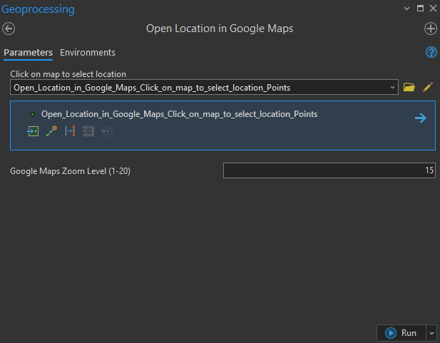
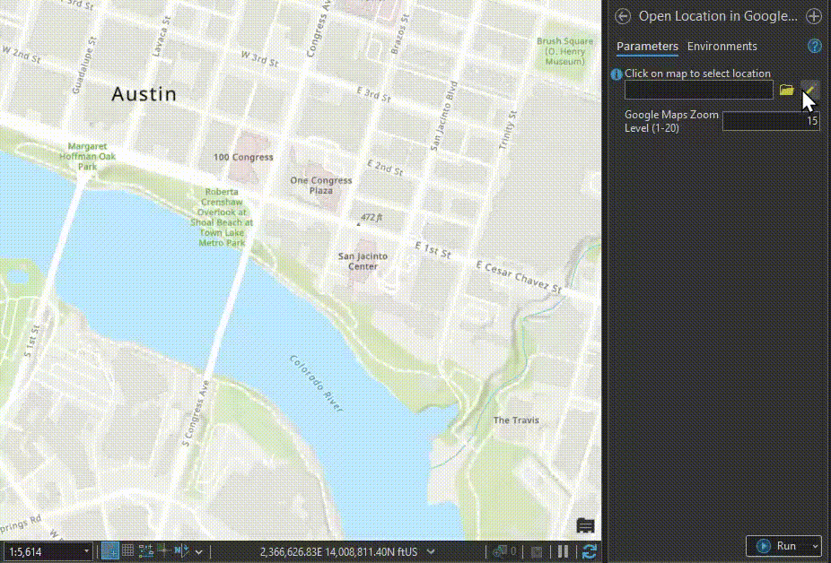

# Google Maps Tools for ArcGIS Pro

A Python toolbox for ArcGIS Pro that allows you to open locations in Google Maps directly from your map by clicking.


## Screenshots


*The tool interface in ArcGIS Pro*


*Clicking on map to open Google Maps*

## Features

- Click on any location in ArcGIS Pro to open it in Google Maps
- Automatic coordinate system conversion to WGS84
- Customizable zoom level for Google Maps
- Opens in your default web browser
- Works with any coordinate system in ArcGIS Pro

## Requirements

- **ArcGIS Pro 3.x**
- **Python 3.x** (included with ArcGIS Pro)
- **Standard Python libraries:** `arcpy`, `webbrowser`, `os`

## Installation

### Download the Toolbox

1. Download `GoogleMapTools.pyt` from this repository
2. Save it to a location on your computer (e.g., `C:\ArcGIS_Tools\`)

### Add to ArcGIS Pro

1. Open ArcGIS Pro
2. Open the **Catalog** pane
3. Right-click on **Toolboxes**
4. Select **Add Toolbox**
5. Browse to and select `GoogleMapTools.pyt`

### Add to Your Project (Optional)

- Copy `GoogleMapTools.pyt` to your project folder
- Add the toolbox using a relative path for better portability

## Usage

### Step 1: Open the Tool

- In the **Geoprocessing** pane, search for "Open Location in Google Maps"
- Or expand the "Google Maps Tools" toolbox and double-click the tool

### Step 2: Select a Location

- Click the small **map icon** next to the "Click on map to select location" parameter
- This activates the point selection tool
- **Click anywhere on your map** to select a location

### Step 3: Set Zoom Level (Optional)

- Adjust the Google Maps zoom level (1-20, default is 15)
- Higher numbers = more zoomed in

### Step 4: Run the Tool

- Click the **Run** button
- Google Maps will open in your default browser at the selected location

## How It Works

The tool:
1. Captures the point you click on the map
2. Gets the spatial reference of your active map
3. Projects the coordinates to WGS84 (latitude/longitude) if needed
4. Constructs a Google Maps URL with the coordinates
5. Opens the URL in your default web browser

## Troubleshooting

### Tool doesn't appear in ArcGIS Pro

- Make sure you've added the toolbox correctly via Catalog pane
- Try closing and reopening ArcGIS Pro
- Check that the .pyt file isn't corrupted

### Can't click on the map

- Make sure to click the **map icon** next to the parameter first
- This activates the interactive point selection mode
- Look for the crosshair cursor indicating selection mode is active

### Coordinates are wrong

- The tool automatically converts coordinates to WGS84
- If results are incorrect, check your map's spatial reference
- Verify the coordinate system is properly defined

### Browser doesn't open

- Check your default browser settings
- Make sure you have internet connectivity
- Try manually opening the URL shown in the tool messages

## Making the Tool Persistent

To keep the toolbox available across sessions:

### Copy to Project Folder

```
YourProject/
├── YourProject.aprx
├── Tools/
│   └── GoogleMapTools.pyt
```

### Add to Favorites

- Right-click the tool in Geoprocessing pane
- Select "Add to Favorites"

### Add to Quick Access Toolbar

- Right-click the ArcGIS Pro ribbon
- Select "Customize the Ribbon"
- Add your tool to the Quick Access Toolbar

## Contributing

Contributions are welcome! Please feel free to submit a Pull Request.

1. Fork the repository
2. Create your feature branch (`git checkout -b feature/AmazingFeature`)
3. Commit your changes (`git commit -m 'Add some AmazingFeature'`)
4. Push to the branch (`git push origin feature/AmazingFeature`)
5. Open a Pull Request

## License

This project is licensed under the MIT License - see the [LICENSE](LICENSE) file for details.

## Acknowledgments

- Built using ArcGIS Pro Python Toolbox framework
- Uses the ArcPy library for geospatial operations

## Author

- GitHub: [@cpickett101](https://github.com/cpickett101)
- Email: christopherbpickett@gmail.com
- LinkedIn: [Christopher Pickett](https://www.linkedin.com/in/christopher-p-a4908979/)

## Support

If you encounter any issues or have questions:
- Open an [issue](https://github.com/cpickett101/google-maps-tools/issues)
- Submit a pull request
- Check existing issues for solutions

---

**Note:** This tool requires an active internet connection to open Google Maps in your browser.
